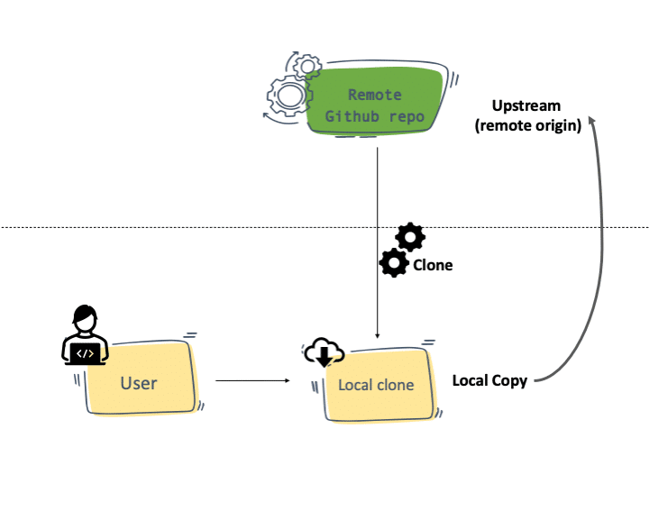
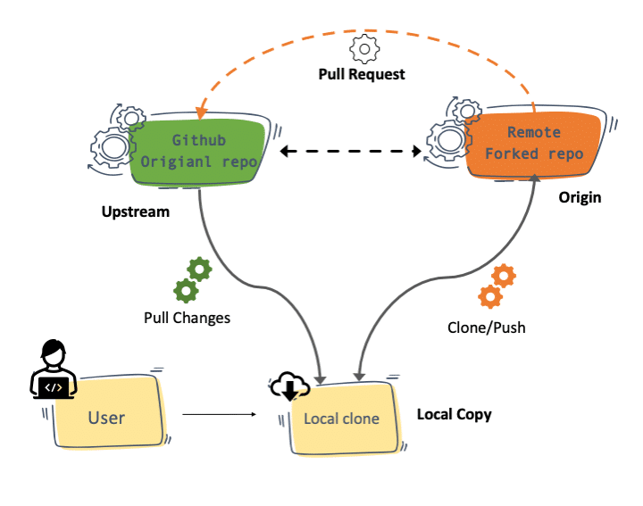
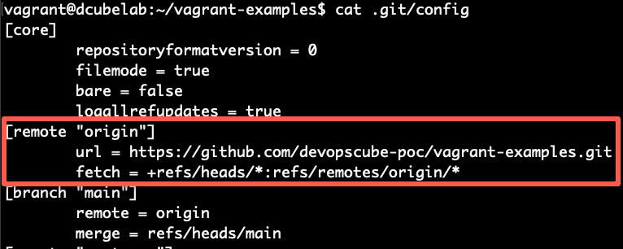
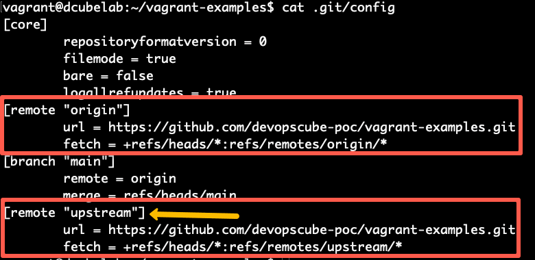

## How to start contributing in opensource?

- In type of repo you can contribue you can either add new features , reolved bug , etc;
- How to start contributing?
  - `step-1` : Find good open source repo and also check the language (in which you are comfortable), so that you can understand the repo.
  - `step-2` : Now try to search the website link (if web app) or if it`s related to package then do nothing.
  - `step-3` : Now you need to fork this repo in your github account using fork button.
  - `step-4` : Now clone the repo that you forked in your github account.
  - `step-5` : Now go to readme file and try to see how to download package/libraries that are required to run that project.
  - `step-6`: Now go to the repo and search for either `good first issues` if you are beginner otherwise you can choose bugs , new features tags in `Issues` section.
  - `step-7` : Choose any one of them and start writing code which gives you exact that output that is required .
  - `step-8` : Once you completed / fixes the issue /features , now you need to create `pull request` base-branch should be `open-source main-branch` and from -`your feature branch anme`; -`NOTE`: while creating a branch in your repo make sure name should be relevant , try to add that issue id number so that it makes some sense.
  - `step-9` : Now you are good to go for merge request (sometime you will get merge conflict error so you need to resolve this ) and merge it.
  - `step-10` : Now if your code is correct and everything works well then you will get merge request successfully (now ur code had been merged in main branch).

### Now lets talk about how to update your clone repo (with new changes in main repo)

- 

- To get all the latest changes in local repo you need to setup upstream with your local repo, how to do that?

  - When you clone a Forked repository to your local, the forked repository is considered as the remote origin, and the repository you forked from is upstream.
  - This workflow is common in open-source development and even in normal project developments
  - For example, If you wanted to contribute to an open-source project, this is what you do.

  - You would fork the actual project repository.
  - Then you clone from the forked repository.
  - Meanwhile, to keep up with the main open-source repository, you pull the changes from it through your git upstream config.
  - You push your changes to a branch in the forked repository.
  - Then you would raise a PR to the actual project repository from your forked repository.

  - 

#### Add an Upstream Repo

- Before adding upstream, you can take a look at your .git/config file and you will see something like below with a remote origin. Which is a clone of the forked repo.

  - 

- Now lets the add the upstream to our repo with the main project repo URL using the add upstream command.

  - ```bash
       git remote add upstream https://github.com/devopscube/vagrant-examples.git

    ```

- Now if you check the .git/config, you will see an upstream entry as shown below.

  - 

- You can also check out the remote origin and upstream branches using the following command.
  ```
  vagrant@dcubelab:~/vagrant-examples$ git branch --remotes
  origin/HEAD -> origin/main
  origin/dev
  origin/main
  upstream/dev
  upstream/main
  ```
- Sync Changes From The Upstream repo

  - To sync an upstream repo, first, you need to fetch the upstream changes.
  - `git fetch upstream`
  - `git fetch upstream` → “Bring updates here, but don’t touch my code.”
  - `git pull upstream <branch>` → “Bring updates AND merge them into my branch.”

  - Then, merge the changes from the upstream branch to the local branch. In this example, it's the main upstream branch.
  - `git merge upstream/main`

- Flow summary diagram

```
┌──────────────────────────────┐
│ Original Repo (upstream)     │
│ https://github.com/original  │
└────────────┬─────────────────┘
             │  (fork)
             ▼
┌──────────────────────────────┐
│ Your Fork (origin)           │
│ https://github.com/you       │
└────────────┬─────────────────┘
             │  (clone)
             ▼
┌──────────────────────────────┐
│ Local Repo (on your machine) │
│ remotes: origin + upstream   │
└──────────────────────────────┘
```

### Now some important commands related to GIT:

- ` git log` : to check all commits logs,etc.
- `git log --since="yesterday"` : you will get all logs of yesterday.
- `git log --grep=commitmsg` you will get those commits which contains this msg.
- `git checkout <commitid>` it will detached your head pointer and points to this commit id (not poining to the branch).
- Beacause of this command some of the commits are gone , this commits are now called as `dangling commits`.
- How to do undo this things: `git switch -`.
- `git clean -f` : to remove files of untracked area forcefully.
- `git clean --dry-run` it would remove that untracked file and show what are the files would be removed in future.
